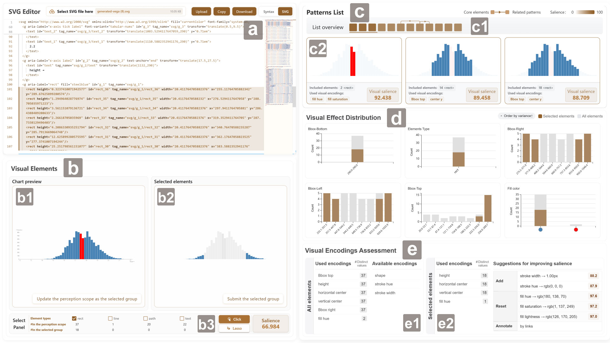

# Revelio: A Perception Effectiveness Assessment Approach for Graphical Patterns in Charts
# 

> he interface of Revelio for assessing the representation effectiveness of patterns in charts. (a) The SVG Editor invites users to upload and edit chart files. (b) The visual element view module allows users to check the rendered chart and select element groups for pattern exploration. (c) The patterns list shows graphical patterns identified from the chart through human perception simulation. (d) The visual effect distribution summarizes the diversity of visual effects among the selected element group and the entire chart. (e) The visual encodings assessment view describes the usage of visual encodings and suggests chart optimizations that can increase the salience of the selected element group.

